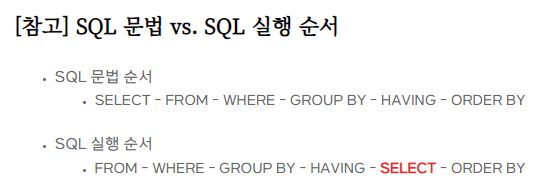
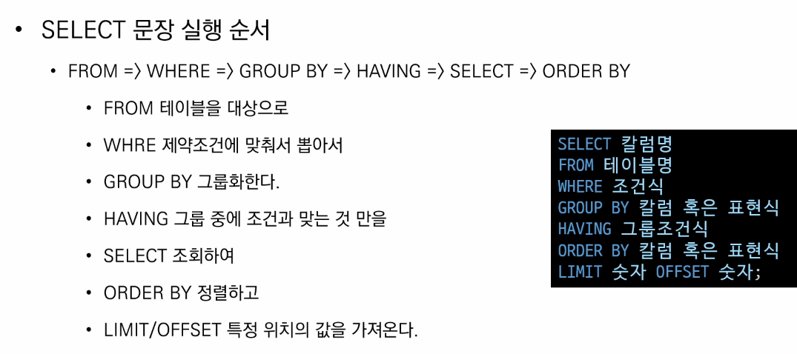

## SQLite

- **서버 형태가 아닌 파일 형식**으로 응용 프로그램에 넣어서 사용하는 **비교적 가벼운 데이터베이스**
- 구글 안드로이드 운영체제에 기본적으로 탑재된 데이터베이스이며, 임베디드 소프트웨어에도 많이 사용됨
- 로컬에서 간단한 DB 구성을 할 수 있으며, 오픈소스 프로젝트이기 때문에 자유롭게 사용가능


#### **SQLite 데이터 타입**

| 타입    | 설명                                                        |
| ------- | ----------------------------------------------------------- |
| INTEGER | 정수                                                        |
| TEXT    | 문자열                                                      |
| BLOB    | 이진 데이터 (대용량의 바이너리 데이터를 저장하기 위한 타입) |
| REAL    | 실수                                                        |
| NUMERIC | 정수 또는 실수                                              |


------

## **SQL**

> 관계형 데이터베이스 관리시스템의 데이터 관리를 위해 설계된 특수 목적으로 프로그래밍 언어

- **스키마 생성 및 수정**
- **자료의 검색 및 관리**
- **데이터베이스 객체 접근 조정 관리**


| 분류                                                         | 개념                                                      |
| ------------------------------------------------------------ | --------------------------------------------------------- |
| **DDL** (Data **Definition** Language) - **데이터 정의 언어** | 관계형 데이터베이스 `구조를 정의` 하기 위한 명령어        |
| **DML** (Data **Maripulation** Language) - **데이터 조작 언어** | `데이터를 저장, 조회, 수정, 삭제` 들을 하기 위한 명령어   |
| **DCL** (Data **Control** Language) - **데이터 제어 언어**   | 데이터베이스 `사용자의 권한 제어` 를 위해 사용하는 명령어 |


### **필드 제약 조건** 

- `NOT NULL` : null 값 입력 금지
- `UNIQUE` : 중복 값 입력 금지
- `PRIMARY KEY` : 유일한 값
- `FOREIGN KEY` : 외래키
- `CHECK` : 조건으로 설정된 값만 입력 허용
- `DEFAULT` : 기본 설정 값


```sqlite
-- classmates라는 이름의 테이블 생성
CREATE TABLE classmates(
	id INTEGER PRIMARY KEY,
  name TEXT
);


-- 테이블 목록 조회
.tables


-- 특정 테이블 스키마 조회
.schema classmates


-- 값 추가
INSERT INTO calssmates VALUES (1, '조세호');


-- 테이블 조회
SELECT * FROM classmates;


-- 테이블 삭제
DROP TABLE classmates;


-- 해석
-- students라는 테이블을 생성할건데,
-- id는 정수고 유일한 값이야.
-- name은 문자이고 비어있어서는 안돼.
-- age는 정수고 기본값은 1이면서, 0보다는 큰지 확인해줘.
CREATE TABLE students(
	id INTEGER PRIMARY KEY,
  name TEXT NOT NULL,
  age INTEGER DEFAULT 1 CHECK (0 < age)
)
```


------

## **CREATE** 


### **INSERT** 

> Insert a single row into a table

- 테이블에 단일 `행 삽입`
- 테이블에 정의된 모든 컬럼에 맞춰 순서대로 입력

```sqlite
-- CREATE


-- Parse error: table classmates has 3 column but 2 values were supplied -> 테이블에 열이 3개인데 2개만 넣었어. 어디에 넣을려고 하는거야?
INSERT INTO classmates VALUES ('홍길동', 23); 


-- 테이블에 데이터를 삽입하고 조회하기
INSERT INTO classmates (name, age) VALUES ('홍길동', 23);
SELECT * FROM classmates;


INSERT INTO classmates (name, age, address) VALUES ('홍길동', 23, '서울');
INSERT INTO classmates VALUES ('김철수', 23, '서울');


-- 한번에 삽입하고 싶다면
INSERT INTO classmates VALUES
	('홍길동', 30, '서울'),
  ('김철수', 30, '제주'),
  ('이호영', 26, '인천'),
  ('박민희', 29, '대구'),
  ('최혜영', 28, '전주');
```


------

## **READ** 


### **SELECT** 

> Query data from a table

- 테이블에서 `데이터를 조회`

  - SELECT 문은 SQLite에서 가장 기본이 되는 문이며, 다양한 절(clause)과 함께 사용

    ORDER BY, DISTINCT, WHERE, LIMIT, GROUP BY ...

```sqlite
SELECT 컬럼1, 컬럼2, ... FROM 테이블명;
```


### **LIMIT** 

> 'constrain the number of rows retrurned by a qeury'

- 퀴리에서 `반환되는 행 수를 제한`
- 특정 행부터 시작해서 조회하기 위해 OFFSET 키워드와 함께 사용하기도 함
  - `OFFSET` : 처음부터 주어진 요소나 지점까지의 차이를 나타내는 정수형

```sqlite
SELECT 컬럼1, 컬럼2, ... FROM 테이블명 LIMIT 숫자;

SELECT 컬럼1, 컬럼2, ... FROM 테이블명 LIMIT 숫자 OFFSET 숫자;
```


### **WHERE** 

> 'specify the search condition for rows returned by the query'

- 쿼리에서 반환된 행에 대한 `특정 검색 조건` 을 지정

```sqlite
SELECT 컬럼1, 컬럼2, ... FROM 테이블명 WHERE 조건;
```


### **SELECT DISTINCT** 

> 'remove duplicate rows in the result set'

- 조회 결과에서 `중복 행을 제거`
- DISTINCT 절은 SELECT 키워드 바로 뒤에 작성해야 함

```sqlite
SELECT DISTINCT 컬럼 FROM 테이블명;
```


## 실습

### CREATE, DROP

- 데이터베이스 생성하기

  ```sqlite
  $ sqlite3 tutorial.sqlite3
  sqlite> .database
  ```

- csv 파일을 table로 만들기

  ```sqlite
  sqlite> .mode csv
  sqlite> .import hellodb.csv examples
  sqlite> .tables
  examples
  sqlite> SELECT * FROM examples;
  1,"길동","홍",600,"충청도",010-0000-0000
  ```

- `CREATE TABLE`

  - 데이터베이스에서 테이블 생성

  ```sqlite
  CREATE TABLE classmates (
      id INTEGER PRIMARY KEY,
      name TEXT
  );
  ```

  ```sqlite
  sqlite> CREATE TABLE classmates (
     ...> id INTEGER PRIMARY KEY,
     ...> name TEXT
     ...> );
  sqlite> .tables
  classmates examples
  ```

- 특정 테이블의 schema 조회

  ```sqlite
  sqlite> .schema classmates
  CREATE TABLE classmates (
  id INTEGER PRIMARY KEY,
  name TEXT
  );
  ```

- `DROP TABLE`

  - 데이터베이스에서 테이블 제거

  ```sqlite
  sqlite> DROP TABLE classmates;
  sqlite> .tables
  examples
  ```

- 필드 제약 조건

  - NOT NULL : NULL 값 입력 금지
  - UNIQUE : 중복 값 입력 금지 (NULL 값은 중복 입력 가능)
  - PRIMARY KEY : 테이블에서 반드시 하나. NOT NULL + UNIQUE
  - FOREIGN KEY : 외래키. 다른 테이블의 Key
  - CHECK : 조건으로 설정된 값만 입력 허용
  - DEFAULT : 기본 설정 값

### INSERT

- 테이블에 단일 행 삽입

  ```sqlite
  INSERT INTO 테이블_이름 (컬럼1, 컬럼2) VALUES (값1, 값2);
  ```

- 테이블에 정의된 모든 열에 맞춰 순서대로 입력

  ```sqlite
  INSERT INTO 테이블_이름 VALUES (값1, 값2, 값3);
  ```

- `rowid` : SQLite에서 PRIMARY KEY가 없는 경우 자동으로 증가하는 PRIMARY KEY 열

  ```sqlite
  sqlite> SELECT rowid, * FROM classmates;
  rowid       name        age         address
  ----------  ----------  ----------  ----------
  1           홍길동       23
  2           홍길동       30          서울
  ```

  - 만약 스키마에 id 기본키를 직접 작성할 경우, 입력할 column들을 명시하지 않으면 자동으로 입력되지 않음

    ```sqlite
    INSERT INTO classmates VALUES (1, '홍길동', 30, '서울'); 
    # id를 포함한 모든 value를 작성
    
    INSERT INTO classmates (name, age, address) VALUES ('홍길동', 30, '서울'); 
    # 각 value에 맞는 column들을 명시적으로 작성
    ```

- 여러 값 한번에 넣기

  ```sqlite
  INSERT INTO classmates VALUES
  ('홍길동', 30, '서울'), 
  ('김철수', 30, '제주'),
  ('이호영', 26, '인천'),
  ('박민희', 29, '대구'),
  ('최혜영', 28, '전주');
  ```

### SELECT

```sqlite
SELECT col1, col2, ... FROM table_name;
SELECT * FROM table_name;
```

- 테이블에서 데이터를 조회

- 가장 기본이 되는 문이며 다양한 절과 함께 사용

  - `ORDER BY`, `DISTINCT`, `WHERE`, `LIMIT`, `GROUP BY` …

  - `LIMIT`

    - 쿼리에서 반환되는 행 수를 제한
    - 특정 행부터 시작해서 조회하기 위해 `OFFSET` 키워드와 함께 사용하기도 함

  - `OFFSET`

    - 처음부터 주어진 요소나 지점까지의 차이를 나타내는 정수형

    - 0부터 시작함

      ```sqlite
      SELECT * FROM MY_TABLE LIMIT 10 OFFSET 5;
      # 6번째 행 부터 10개 행을 조회 (6번째 행부터 10개를 출력)
      ```

  - `WHERE`

    - 쿼리에서 반환된 행에 대한 특정 검색 조건을 지정

  - `SELECT DISTINCT`

    - 조회 결과에서 중복 행을 제거
    - DISTINCT 절은 SELECT 키워드 바로 뒤에 작성해야 함

  - `ORDER BY`

    - 쿼리에서 반환되는 행을 특정 열을 기준으로 오름차순 혹은 내림차순 정렬

  - `GROUP BY`

    - 특정 열에 대해 같은 값을 가진 행끼리 묶어서 그룹화
    - 그룹화한 결과에 조건 처리를 하기 위해선 `HAVING` 절을 사용해야 함


#### [** SELECT 와 많이 사용하는 명령어**](https://suy379.tistory.com/104#1._FROM_:_테이블_선택)

#### [ SQL 문법 vs SQL 실행순서](https://suy379.tistory.com/104#1._FROM_:_테이블_선택)







## 쿼리 예시커맨드

```sqlite
-- 30세 이상인 사람들
SELECT * FROM users WHERE age >= 30;
-- 30세 이상인 사람들의 이름
SELECT first_name FROM users WHERE age >= 30;
-- 30세 이상인 사람들의 이름 3명만
SELECT first_name FROM users WHERE age >= 30 LIMIT 3;
-- 30세 이상이고 성이 김인 사람
SELECT age, first_name FROM users WHERE age >= 30 AND last_name = '김';

-- 30세 이상인 사람들의 숫자
SELECT COUNT(*) FROM users WHERE age >= 30;
-- 전체 중에 가장 작은 나이
SELECT MIN(age) FROM users;
-- 이씨 중에 가장 작은 나이
SELECT MIN(age) FROM users WHERE last_name = '이';
-- 이씨 중에 가장 작은 나이를 가진 사람의 이름과 계좌잔고
SELECT MIN(age), first_name, balance FROM users WHERE last_name = '이';
-- 30세 이상인 사람들의 평균 나이
SELECT AVG(age) FROM users WHERE age >= 30;
-- 계좌 잔액이 가장 높은 사람
SELECT MAX(balance), first_name FROM users;

-- 지역번호가 02인 사람
SELECT COUNT(*) FROM users WHERE phone LIKE '02-%';
-- 준으로 끝나는 사람
SELECT COUNT(*) FROM users WHERE first_name LIKE '%준';
-- 중간번호가 5114
SELECT COUNT(*) FROM users WHERE phone LIKE '%-5114-%';

-- 나이 오름차순 
SELECT first_name FROM users ORDER BY age ASC LIMIT 10;
-- 나이, 성 순으로 오름차순
SELECT * FROM users ORDER BY age, last_name LIMIT 10;
-- 계좌 잔액 순 내림차순 
SELECT last_name, first_name, balance FROM users ORDER BY balance DESC LIMIT 10;
-- 계좌 잔액 내림차순(높은->낮은 것), 성 오름차순(ㄱ->ㅎ)
SELECT last_name, first_name, balance FROM users ORDER BY balance DESC, last_name ASC LIMIT 10;

----------------------------------------------------------------------------

SELECT * FROM users LIMIT 1;

-- pipe sign 엔터 위에 있어요 보통
-- 문자열 합치기 ||
-- (성+이름) 출력, 5명만
SELECT 
    last_name || first_name 이름,
    age,
    country,
    phone,
    balance
FROM users
LIMIT 5;

-- 이름   age  country  phone          balance
-- ---  ---  -------  -------------  -------
-- 유정호  40   전라북도     016-7280-2855  370
-- 이경희  36   경상남도     011-9854-5133  5900
-- 구정자  37   전라남도     011-4177-8170  3100
-- 장미경  40   충청남도     011-9079-4419  250000
-- 차영환  30   충청북도     011-2921-4284  220

-- 문자열 길이 LENGTH
SELECT 
    LENGTH(first_name),
    first_name
FROM users
LIMIT 5;
-- LENGTH(first_name)  first_name
-- ------------------  ----------
-- 2                   정호
-- 2                   경희
-- 2                   정자
-- 2                   미경
-- 2                   영환

-- 문자열 변경 REPLACE
-- 016-7280-2855 => 01672802855
SELECT 
    first_name,
    phone,
    REPLACE(phone, '-', '')
FROM users
LIMIT 5;

-- 숫자 활용
SELECT MOD(5, 2)
FROM users
LIMIT 1;

-- 올림, 내림, 반올림
SELECT CEIL(3.14), FLOOR(3.14), ROUND(3.14)
FROM users
LIMIT 1;

-- 9의 제곱근
SELECT SQRT(9)
FROM users
LIMIT 1;

-- 9^2
SELECT POWER(9, 2)
FROM users
LIMIT 1;

----------------------------------------------------------------

-- GROUP BY

-- 성별 갯수
SELECT last_name, COUNT(*)
FROM users
GROUP BY last_name;

-- GROUP BY에서 활용하는 컬럼을 제외하고는
-- 집계함수를 쓰세요.
SELECT last_name, AVG(age), COUNT(*)
FROM users
GROUP BY last_name;

-- 참고...
SELECT last_name, age
FROM users
WHERE last_name = '곽';
-- last_name  age
-- ---------  ---
-- 곽          25
-- 곽          30
-- 곽          28
-- 곽          15

-- GROUP BY는 결과가 정렬되지 않아요. 기존 순서와 바뀜
-- 원칙적으로 내가 정렬해서 보고 싶으면 ORDER BY!

SELECT *
FROM users
LIMIT 5;
-- first_name  last_name  age  country  phone          balance       
-- ----------  ---------  ---  -------  -------------  -------       
-- 정호          유          40   전라북도     016-7280-2855  370    
-- 경희          이          36   경상남도     011-9854-5133  5900   
-- 정자          구          37   전라남도     011-4177-8170  3100   
-- 미경          장          40   충청남도     011-9079-4419  250000 
-- 영환          차          30   충청북도     011-2921-4284  220  

SELECT last_name, COUNT(*)
FROM users
GROUP BY last_name
LIMIT 5;

-- last_name  COUNT(*)
-- ---------  --------
-- 강          23
-- 고          10
-- 곽          4
-- 구          2
-- 권          17

-- GROUP BY WHERE를 쓰고 싶다.
-- 100번 이상 등장한 성만 출력하고 싶음. 
SELECT last_name, COUNT(last_name)
FROM users
WHERE COUNT(last_name) > 100
GROUP BY last_name;
-- 오류 발생!
-- Parse error: misuse of aggregate: COUNT()
--   LECT last_name, COUNT(last_name) FROM users WHERE COUNT(last_name) > 100 GROUP

-- 조건에 따른 GROUP 하시려면
-- HAVING을 쓴다!(HAVING절에는 집계함수-avg,count-만 사용)
SELECT last_name, COUNT(last_name)
FROM users
GROUP BY last_name
HAVING COUNT(last_name) > 100;
```


## Join

관계형 데이터베이스의 가장 큰 장점이자 핵심적인 기능

일반적으로 데이터베이스에는 하나의 테이블에 많은 데이터를 저장하는것이 아닌, 여러 테이블로 나눠 저장하게 되며, 여러 테이블을 결합(Join)하여 출력하여 활용한다. 일반적으로 레코드는 기본키(PK)나 외래키(FK) 값의 관계에 의해 결합한다.

#### 대표적인 JOIN

- INNER JOIN : 두 테이블에 모두 일치하는 행만 반환 (교집합)

  ```
  -- 테이블1과 테이블2에서 값이 일치하는 것들만 가져옴
  SELECT *
  FROM 테이블1 [INNER](생략가능) JOIN 테이블2
  ON 테이블1.컬럼 = 테이블2.컬럼
  
  SELECT *
  FROM users JOIN role
  ON users.role_id = role.id;
  -- 스태프(2)만 출력
  SELECT *
  FROM users JOIN role
  ON users.role_id = role.id
  WHERE role.id = 2;
  -- 이름을 내림차순으로
  SELECT *
  FROM users JOIN role
  ON users.role_id = role.id
  WHERE role.id = 2
  ORDER BY users.name DESC;
  ```

- OUTER JOIN : 동일한 값이 없는 행도 반환할때 사용

  - 기준이 되는 테이블에 따라 LEFT/RIGHT/FULL을 지정함

  ```
  SELECT *
  FROM 테이블1 [LEFT|RIGHT|FULL] OUTER JOIN 테이블2
  ON 테이블1.컬럼 = 테이블2.컬럼
  
  SELECT *
  FROM articles LEFT OUTER JOIN users
  ON articles.user_id = users.id;
  ```

- CROSS JOIN : 모든 데이터의 조합

  ```
  SELECT *
  FROM users CROSS JOIN role
  ```


## ORM

#### 1. ORM(Object Relational Mapping)

- 객체 지향 프로그래밍 언어를 사용하여 호환되지 않는 유형의 시스템 간의 데이터를 변환하는 프로그래밍 기술

- 파이썬에서는 SQLAIchemy, peewee 등 라이브러리가 있으며, Django 프레임워크에서는 내장 Django ORM을 활용

- "객체(object)로 DB를 조작한다"

  ```
  Genre.objects.all()
  ```

- DB 조작(관리) 시 모델링 파트, 테이블 조작 파트가 따로 존재

  - 모델링 할 땐 class 생성, 테이블 조작 할 땐 Migration ⭐️
  - 참고) CRUD Operation은 객체를 조작하면서 작동
  - 모델 설계 및 반영

  ```
  - 1. 클래스를 생성하여 내가 원하는 DB의 구조를 만듦
  class Genre(models.Model):
  	name = models.CharField(max_length = 30)
  	
  - 2. 클래스의 내용으로 데이터베이스에 반영하기 위한 마이그레이션 파일을 '자동' 생성
  $ python manage.py makemigrations
  
  - 3. DB에 migrate
  $ python manage.py migrate
  ```

  > Migration(마이그레이션)
  >
  > - Model에 생긴 변화를 DB에 반영하기 위한 방법
  > - 마이그레이션 파일을 만들어 DB 스키마를 반영
  > - 명령어
  >   - `makemigrations` : 마이그레이션 파일 생성
  >   - `migrate` : 마이그레이션을 DB에 반영

  - Migrate 살펴보기

  ```
  BEGIN;
  --
  -- Create model Genre
  -- 
  CREATE TABLE "db_genre" ("id" integer NOT NULL PRIMARY KEY AUTOINCREMENT, "name" varchar(30 NOT NULL);
  COMMIT;
  
  -- cf) 트랜잭션
  ```

- 데이터베이스 조작(Database API)

  ```
  Genre.         objects.     all()
  #Class Name    #MANAGER     #QuerySet API
  ```

#### 2. ORM 기본 조작

- Create

  ```
  # 1. create 메서드 활용
  Genre.objects.create(name = '발라드')
  
  # 2. 인스턴스 조작
  genre = Genre()
  genre.name = '인디밴드'
  genre.save()
  ```

  **✏️ `Get`과 `Filter`의 차이** ⭐️

  ```
  In [14]: Genre.objects.get(id=1)
  Out[14]: <Genre: Genre object (1)>
  -> 반드시 하나. 없거나, 많으면 오류 띄움
  -> PK : PRIMARY KEY 사용은 get 사용
  
  In [15]: Genre.objects.filter(id=1)
  Out[15]: <QuerySet [<Genre: Genre object (1)>]>
  -> 무조건 결과가 QuerySet(일종의 리스트)
  ```

- Read

  ```
  # 1. 전체 데이터 조회
  Genre.objects.all()
  # <QuerySet [<Genre: Genre object (1)>, <Genre: Genre object (2)>, <Genre: Genre object (3)>]>
  
  # 2. 일부 데이터 조회(get)
  Genre.objects.get(id=1)
  # <Genre: Genre object (1)>
  
  # 3. 일부 데이터 조회(filter)
  Genre.objects.filter(id=1)
  # <QuerySet [<Genre: Genre object (1)>]>
  ```

- Update

  ```
  # Create는 처음부터 새로 만드는 것, Update는 기존 테이블을 가져와서 수정하는 것
  
  # 1. genre 객체 활용
  genre = Genre.objects.get(id=1)
  
  # 2. genre 객체 속성 변경
  genre.name = '트로트'
  
  # 3. genre 객체 저장
  genre.save()
  ```

- Delete

  ```
  # 1. genre 객체 활용
  genre = Genre.objects.get(id=1)
  
  # 2. genre 객체 삭제
  genre.delete()
  
  # 이렇게도 사용 가능
  Genre.objects.get(id=1).delete()
  # 파이썬에서 '  abc  '.strip().upper() 같은 느낌으로 작동
  ```

- Artist 모델 생성

  ```
  class Artist(models.Model);
  	name = models.CharField(max_length=30)
    debut = models.DateField()
  ```

- 마이그레이션 파일 생성 ➡️ 마이그레이션을 DB에 반영

  ```
  $ python manage.py makemigrations
  $ python manage.py migrate
  ```

- 관련자료

  https://blog.naver.com/yjkang0383/222646973540
